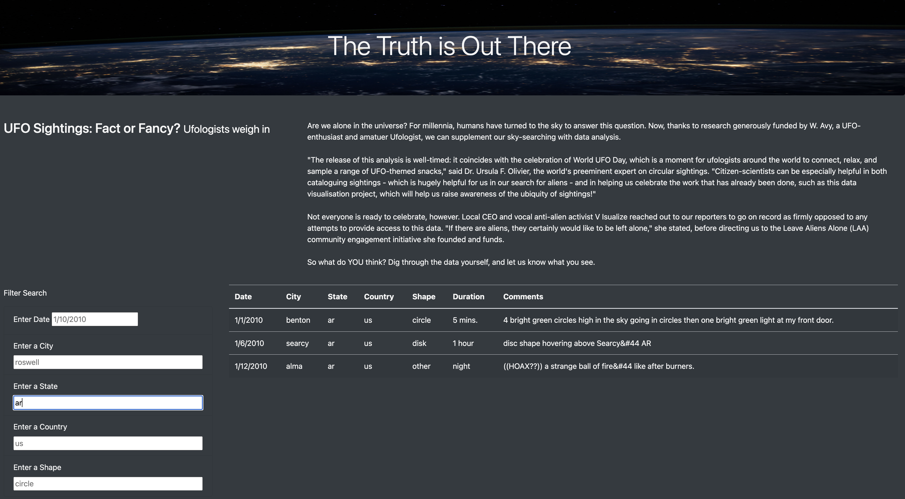

# UFOs

## Overview of Analysis

The purpose of this analysis is to create a web page with a dynamic table showing the results of filtered UFO sighting data. The first website created offered users only a date filter. However, for this project, I want to allow users to filter data beyond just dates. Additional filters for the table include City, State, Country, and Shape.

_____

## Results

Previously, web pages contained only date filters that required the user to click a button to apply the filter. The newly updated version allows users to filter data simply by entering criteria in any filter field. The website then automatically filters the table to display relevant data. The first figure shows a table without filters. The user can see in the text box what kind of formatting is required for the filter to work. As you type, the table automatically filters the results accordingly. 

____
## Summary

A drawback of this website is that it is currently not resizable in relation to the viewing device. part of the website. For example, when a user zooms in on her webpage,  the image can be resized, but not the entire webpage. A recommendation for further development is therefore to add formatting that realigns sections and margins when the page is viewed on a mobile device or tablet.

Another additional feature you can add to your website is a survey form. The poll asks users about their experiences with sightings of extraterrestrial life. You can include questions such as descriptions of what you saw, time periods, general geographic locations, and other interesting details. This allows you to add new user sightings to expand your table and database. 